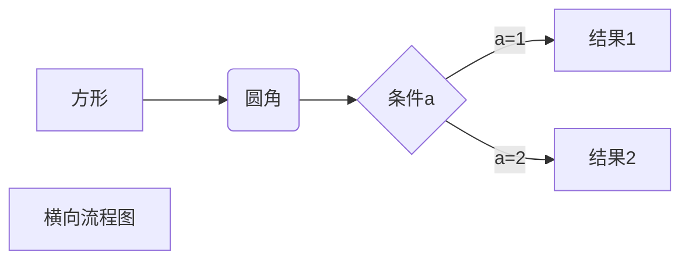

<link rel="stylesheet" href="./katex.min.css">

# Markdown 语法

[[TOC]]

## 1.标题

```markdown
# 一级标题

## 二级标题

### 三级标题
```

# 一级标题

## 二级标题

### 三级标题

---

## 2.引用

```markdown
> 引用
```

> 内容引用

---

## 3.列表

```markdown
- 无序列表
- 无序列表
- 无序列表
  TAB 键 二级列表

1. 有序列表
2. 有序列表
3. 有序列表
   TAB 键 二级列表
```

- 无序列表
- 无序列表
- 无序列表
  - 二级列表
    - 三级列表

1. 有序列表
2. 有序列表
3. 有序列表
   1. 二级列表
      1. 三级列表

---

## 4.任务列表

```markdown
任务列表

- [ ] 任务 1
- [ ] 任务 2
- [ ] 任务 3
- [x] 任务 4
```

- [ ] 1
- [ ] 2
- [ ] 3
- [x] 4

---

## 5.代码

````markdown
代码块使用三个`

```go
package main

import "fmt"

func main() {
	fmt.Printf("Hello Markdown!\n")
}
```

内嵌代码，无语法高亮，使用一个`

`printf("Hello World!\n")`
````

```go
package main

import "fmt"

func main() {
    fmt.Printf("Hello Markdown!\n")
}
```

这是 C 语言`printf("Hello World!\n")`

---

## 6.文字效果

```markdown
**粗体**
_斜体_
**_粗体+斜体_**
~~删除线~~
<sub>下标</sub> H<sub>2</sub>O ~下标~，H~2~O
<sup>下标</sup> E=mc<sup>2</sup> ^上标^，y=x^3^
<mark>高亮</mark> ==高亮==
------ 分割线
:emoji:
在 emoji 前加#可实现大小控制
```

**粗体**

_斜体_

**_粗体+斜体_**

~~删除线~~

CO<sub>2</sub> H~2~O

<mark>123</mark>

E=mc<sup>2</sup> y=x^3^

==高亮==

:small_airplane::love_letter::airplane::coffee:

更多 emoji 可以参考该网站[emoji 查询](https://www.webfx.com/tools/emoji-cheat-sheet/ 'emoji大全')

---

## 7.脚注

```markdown
脚注
[^example]
[^ 1 ]:脚注内容
```

脚注示例[^1]

[^1]: 这是一个脚注

---

## 8.链接

```markdown
内嵌链接（Inline Links）
[GitHub](https://github.com/ 'Title可选')

参考链接（Reference Links）
[参考链接][id]
[id]:http://www.163.com "网易"

内部链接（Internal Links）
[内部链接演示](#三级标题)
```

[GitHub](https://github.com '访问GitHub')

[参考链接][5]

[5]: http://163.com '网易'

[内部链接](#三级标题)

---

## 9.图片

```markdown
插入图片

```


---

## 10.公式

```markdown
行内嵌入公式
$\lim_{x \to \infty} \exp(-x) = 0$

公式块

$$
\mathbf{V}_1 \times \mathbf{V}_2 =  \begin{vmatrix}
\mathbf{i} & \mathbf{j} & \mathbf{k} \\
\frac{\partial X}{\partial u} &  \frac{\partial Y}{\partial u} & 0 \\
\frac{\partial X}{\partial v} &  \frac{\partial Y}{\partial v} & 0 \\
\end{vmatrix}
$$
```

$\lim_{x\to\infty}\exp(-x) = 0$

$$
\mathbf{V}_1 \times \mathbf{V}_2 =  \begin{vmatrix}
\mathbf{i} & \mathbf{j} & \mathbf{k} \\
\frac{\partial X}{\partial u} &  \frac{\partial Y}{\partial u} & 0 \\
\frac{\partial X}{\partial v} &  \frac{\partial Y}{\partial v} & 0 \\
\end{vmatrix}
$$

---

## 11.目录

```markdown
目录
[TOC]
```

演示效果见文章开头

---

## 12.表格

```markdown
表格
| First Header | Second Header |
| ------------- | ------------- |
| Content Cell | Content Cell |
| Content Cell | Content Cell |

| Left-Aligned  | Center Aligned  | Right Aligned |
| :------------ | :-------------: | ------------: |
| col 3 is      | some wordy text |         $1600 |
| col 2 is      |    centered     |           $12 |
| zebra stripes |    are neat     |            $1 |
```

| First Header | Second Header |
| ------------ | ------------- |
| Content Cell | Content Cell  |
| Content Cell | Content Cell  |

| Left-Aligned  | Center Aligned  | Right Aligned |
| :------------ | :-------------: | ------------: |
| col 3 is      | some wordy text |         $1600 |
| col 2 is      |    centered     |           $12 |
| zebra stripes |    are neat     |            $1 |

## 13.HTML 元素

```markdown
使用 <kbd>Ctrl</kbd>+<kbd>Alt</kbd>+<kbd>Del</kbd> 重启电脑
<kbd> <b> <i> <em> <sup> <sub> <br>等
```

## 14.流程图

````markdown

````

---
