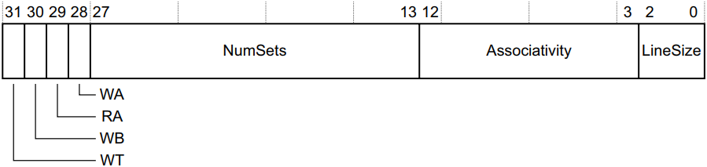

<div align='center' ><font size=6>ARM组相连Cache结构</font></div>
<br>

<div align="center">
    &nbsp;
    &nbsp;
    &nbsp;
    
</div>

Cache的结构有全关联（full-associative），直接映射（direct-mapping）和组关联（set-associative），当前处理器几乎都使用组相连的Cache结构。

组关联Cache的结构如下图所示：


图中的重要概念：

* Way：Cache被分割为数个大小相同的块，每个块称为一个Way。上图中红框部是一个Way，图中共有4个Way。注意：ARM手册中的<mark>*Associativity*</mark>与Way的概念相同。
* Line：Line是Cache中的最小可访问单元，包含一段主存中的数据，ARM架构常见的Line为16 Words，即64 Bytes。上图中蓝色框为一个Line。
* Index：Index是内存地址中的一部分，用于索引使用哪一个Line。
* Set：每一个Way中，Index相同的Line组合起来称为Set。<mark>ARM手册中说的Set数量可以理解为一个Way中Line的数量</mark>。
* Tag：Tag是内存地址的一部分，储存在Cache中，用于标识与Line中数据对应的主存地址。

------

在ARMv7/v8中可以通过CCSIDR 、CLIDR、CTR等寄存器获取处理器的Cache信息，下面举例获取FT1500A/4处理器L1 Data Cache的详细信息。

根据手册可知Cache的信息可通过CCSIDR寄存器获取，由于处理器中存在多级Cache，因此需要先通过CSSELR选择需要查询的Cache等级以及类型。CSSELR寄存器格式如下图所示：


* InD为0选择Data或Unified，为1选择Instruction Cache
* Level用于选择Cache等级，0b000表示L1 Cache，0b110表示L7 Cache，如果写入处理器未实现的Cache等级该字段的结果是不可预测的

向CSSELR寄存器写入0x0，即选择L1 Data Cache，内联汇编如下：

```c
unsigned int csselrWrite (unsigned int val)
{
    __asm__ volatile (
    	        "mcr p15, 2, %0, c0, c0, 0 \n"
    	        :
    	        : "r" (val)
    	        );

    printf("CSSELR=0x%x\n", val);

    return val;
}
```

再读取CCSIDR寄存器，结果为0x701fe00a，CCSIDR寄存器格式如下：



* NumSets：读出的值为Cache Set数量减1，如果该字段的值为0，则Set=1
* Associativity：读出的值为Associativity的数量减1，如果该字段的值为0，则Associativity=1
* LineSize：LineSize = Log<sub>2</sub>(*cache line number*) - 2，即*Cache Line number* = 2<sup>(LineSize + 2)</sup>，注意Cache Line number的单位是word，1 word = 4 byte

根据0x701fe00a可得FT1500A/4处理器L1 Data Cache有2 Way（Associativity），每一Way有256个Line（Set），Cache Line为16 word（64 byte）。计算可得大小为2 \* 256 \* 64 = 32KB。

