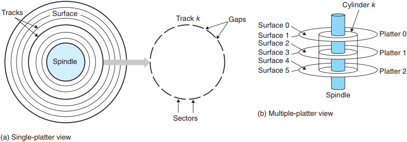
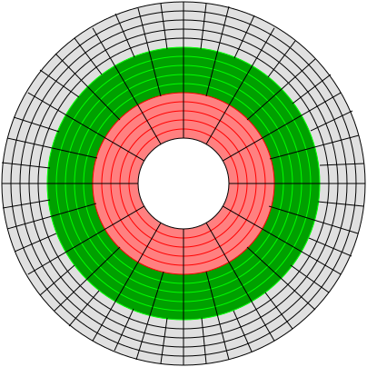
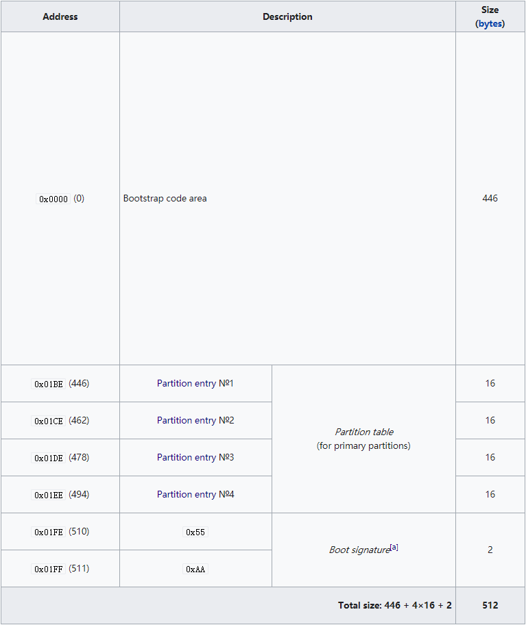
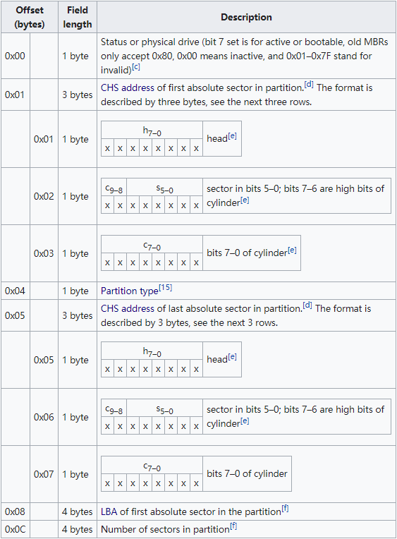
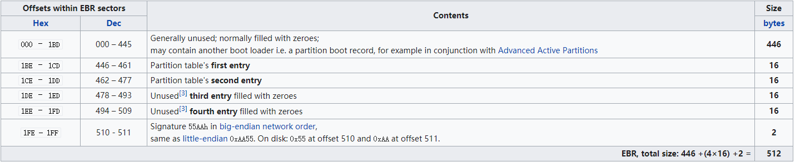
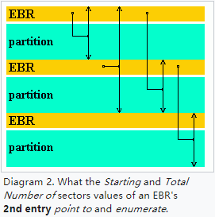
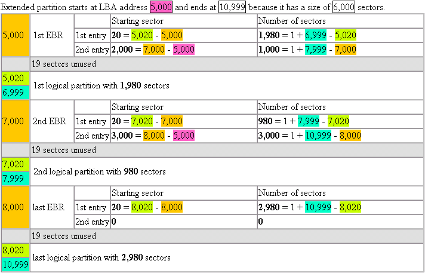
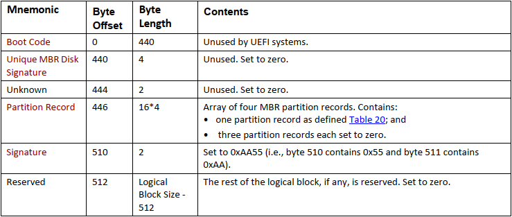
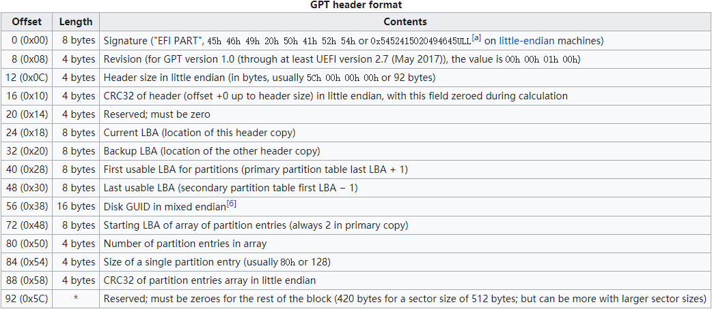
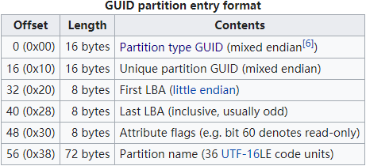

<link rel="stylesheet" href="https://cdnjs.cloudflare.com/ajax/libs/KaTeX/0.5.1/katex.min.css">

磁盘分区表结构分析

 

    &nbsp;
    &nbsp;
    

[[TOC]]

## 1.磁盘

### 1.1 基本构造

磁盘（_Disk_）又被称为磁盘驱动器（_Disk driver_），是由一个或多个叠放在一起的**盘片（_Platter_）**组成的机械装置。每个盘片有上下两**面（Surface）**，表面覆盖着磁性记录材料。盘片中央有一个可以旋转的主轴（_Spindle_），它能使盘片以固定的旋转速率（_Rotational Rate_）旋转，通常是 5400-15000 转每分钟（_Revolution Per Minute, RPM_）。盘片每个面上都对应有一个**磁头（_head_）**进行读写操作。

盘片表面由一组称为**磁道（_Track_）**的同心圆组成，每个磁道被划分为数个**扇区（_Sector_）**，每个扇区包含相同数量的数据位（旧式硬盘为 512 字节，新式硬盘为 4096 字节）。盘片表面上到主轴中心距离相等的磁道的集合称为**柱面（_Cylinder_）**，例如，一个磁盘有三个盘片六个盘面，每个盘面上的磁道编号都是一致的，那么 6 个磁道*k*的集合就是柱面*k*。即，柱面数与一个盘面上的磁道数相同，一个柱面内的磁道数等于盘面数，亦等于磁头数。磁盘构造如下图所示：

在老式磁盘上，不同柱面的磁道所包含的扇区数是相同的，最靠内的磁道决定了磁道内的扇区数 ，这会导致外层磁道空间的严重浪费，因此现代磁盘则将柱面划分成了不同的**环带（_Zone_）**，同一环带内柱面的磁道含有相同数量的扇区，外层环带柱面的磁道比内层环带柱面的磁道拥有更多的扇区，例如下图的磁盘将柱面划分为 3 个环带：

### 1.2 磁盘容量

一个磁盘上可以记录的最大位数称为它的最大容量，简称为容量。了解了磁盘的基本构造就可以通过其物理参数计算出磁盘的容量，公式如下：

$$
磁盘容量 = \frac{字节数}{扇区}×\frac{平均扇区数}{磁道}×\frac{磁道数}{表面}×\frac{表面数}{盘片}×\frac{盘片数}{磁盘}
$$

例如，假设一个磁盘有 5 个盘片，每个扇区 512 字节，每个面 20000 条磁道，每条磁道平均 300 个扇区，那么这个磁盘的容量是：

$$
磁盘容量 = \frac{512字节}{扇区}×\frac{300扇区}{磁道}×\frac{20000磁道}{表面}×\frac{2表面}{盘片}×\frac{5盘片}{磁盘} = 30720000000字节 = 30.72GB
$$

注意，硬盘制造商是以千兆字节（GB）或兆兆字节（TB）为单位来表达磁盘容量的，1GB=10^9^字节，1TB=10^12^字节，而 DRAM 和 SRAM 的计量单位为 1K=2^10^，1M=2^20^，1G=2^30^，1T=2^40^，这也导致了在操作系统中看到的磁盘容量比厂家标称的容量要小的原因。题外话，网络速率的计量单位与磁盘相同。

### 1.3 寻址方式

#### 1.3.1 CHS(Cylinder-head-sector)

CHS 寻址是通过磁盘的柱面和磁头确定磁道，并在该磁道中查找到所需扇区的过程，因此扇区也是 CHS 的最小寻址单元。

- Cylinder：柱面是磁盘中所有盘片表面上到主轴中心距离相等的磁道的集合，因此通过柱面即可确定要操作的磁道所属的集合，柱面从 0 开始编址，位于盘面最外圈。
- Head：磁盘中每个可记录数据的盘面都对应有一个磁头，通过柱面和磁头可确定要操作的磁道，磁头从 0 开始编址。
- Sector：扇区大小在计算机历史上有 128、256、512、1024 字节等多种规格，以 512 字节为主流。2010 年以来的新式硬盘基本都已使用 4096 字节的扇区规格，但都可以模拟为 512 字节。需要注意的是，在 CHS 编址中，扇区号从**1**开始，而不是从 0 开始。

BIOS INT 13*h*接口使用 24 位 CHS 编址格式，其中**10**位用于柱面，**8**位用于磁头，**6**位用于扇区，由此可计算出 24 位 CHS 的寻址范围约为**8G**：

$$
2^{10}×2^{8}×(2^{6}-1)×512=8,455,716,864 Bytes
$$

有意思的是，DOS 7.1 及以下所有版本都存在 BUG，导致在有 256 个磁头的磁盘上启动时系统崩溃，因此当时的 BIOS 和 DOS 都将磁头编址范围限制在了 0-254。

ATA-2（EIDE）标准引入了 28 位 CHS 编址，其中**16**位用于柱面，**4**位用于磁头，**8**位用于扇区，扇区仍从 1 开始编址。28 位 CHS 的寻址范围约为 136G（127.5GiB）：

$$
2^{16}×2^{4}×(2^{8}-1)×512=136,902,082,560 Bytes
$$

CHS 的寻址范围对于如今的磁盘来说已经太小，已不再使用。

#### 1.3.2 LBA(Logical block addressing)

LBA 是非常简单的线性编址模式，其将磁盘分为 512 字节的块，并从 0 开始索引，第一个块称为 LBA0，第二个块称为 LBA1，以此类推。IDE 标准引入了 22 位 LBA，ATA-1 标准引入了 28 位 LBA，ATA-6 引入了 48 位 LBA，使寻址范围达到了 144PB。

MBR 的 Partition entry 中使用 4 字节记录 LBA 地址，因此 MBR 分区表支持的寻址范围是 2^32^×512=2TiB。

## 2.Master Boot Record(MBR)

1983 年 3 月，IBM 通过 PC DOS 2.0 引入了对磁盘分区的支持及 Master Boot Record。MBR 支持的最大磁盘大小为 2TiB，随着大容量磁盘的广泛应用，MBR 已经逐渐被 GUID Partition Table(GPT)取代。

MBR 保存在磁盘的第一个扇区中，如果使用 CHS 寻址，其地址为 0 柱面、0 磁头、1 扇区；如果使用 LBA 寻址，则位于 LBA0。

MBR 的大小为 512 字节，主要包括以下内容：

- 引导代码（Bootstrap code）
- 分区表（Partition table）
- 32 位磁盘时间戳（Disk timestamp）
- 32 位磁盘签名（Disk signature）

不同操作系统和工具对 MBR 格式的定义不尽相同，下面只介绍最常见的经典通用 MBR 格式和现代标准 MBR 格式。

### 2.1 经典通用 MBR（Classical generic MBR）

### 2.2 现代标准 MBR（Modern standard MBR）

### 2.3 分区表（Partition table）

从以上两种格式的 MBR 中可以发现有 64 字节的分区表，分为 4 个**_Partition entry_**，可以记录 4 个分区信息，所谓磁盘分区就是对这 64 个字节的分区表进行设置。

Partition entry 的主要功能就是记录分区的起始位置及大小，其格式及各字段的含义如下图所示。[1.3 章节](###1.3 寻址方式)已经分析过，CHS 寻址的范围太小，现在多采用 LBA 寻址，因此 Partition entry 中比较重要的字段是分区类型（_Partition type_，字段定义可参考该网页[Partition type Wiki](https://en.wikipedia.org/wiki/Partition_type)）、本分区起始扇区的 LBA 索引（偏移 0x08）以及本分区扇区总数（偏移 0x0C）。MBR 分区表使用 4 字节保存扇区起始地址和扇区数量，因此最大只能支持 2^32^×512=2TiB 的分区以及 4TiB 的磁盘（这要求分区时除最后一个分区外所有分区都在 2TiB 地址以内，最后一个分区从 2^32^-1 扇区起始且大小为 2^32^-1）。

分区表最多记录 4 个主分区（Primary partition），想要划分更多分区就需要使用扩展分区（Extended partition），该扩展分区可再划分为多个逻辑分区（Logical partition）。注意，分区表中最多只能有**一个**扩展分区。

### 2.4 Extended boot record（EBR）

逻辑分区的相关描述储存在一个或多个名为 Extended boot record(EBR)的数据结构中，第一个 EBR 位于扩展分区的第一个扇区，如果存在多个逻辑分区，则**每个逻辑分区前都有一个 EBR**，该 EBR 会指向下一个 EBR，从而形成一个 EBR 链表。这也意味着逻辑分区的数量只受扩展分区容量的限制。

EBR 的结构与 MBR 类似，同样为 512 字节，但每个 EBR 的分区表只描述一个逻辑分区以及其与下一个 EBR 的关系，因此只会用到两个 Partition entry，且 Partition entry 的字段含义与 MBR 的不同。

Partition entry 1 用于指向属于该 EBR 的逻辑分区，字段含义如下：

- 起始扇区：本 EBR 扇区与逻辑分区第一个扇区的相对偏移。注意，对于同一个磁盘上的 EBR，该值通常是相同的，例如 Windows XP 中该值通常为 63
- 扇区数：逻辑分区的扇区总数。注意，EBR 与逻辑分区间未使用的扇区不属于逻辑分区

Partition entry 2 用于指向下一个 EBR，如果本 EBR 是最后一个，则填充为 0。字段含义如下：

- 分区类型：0x05（CHS 编址）或 0x0F（LBA 编址）
- 起始扇区：下一个 EBR 扇区与扩展分区**第一个**EBR 扇区的相对偏移
- 扇区数：下一个逻辑分区的扇区总数，注意，该数**包括**下一个 EBR 扇区以及 EBR 与逻辑分区间未使用的扇区

下面的图例可以帮助更好的理解 EBR Partition entry，图中的扩展分区共有 6000 个扇区，分为 3 个逻辑分区：

## 3.GUID Partition Table(GPT)

为了突破 BIOS 的种种限制（如 16 位处理器模式、1MB 地址空间等），Intel 在 1990 年代后期开发了 Extensible Firmware Interface (EFI)。2005 年 7 月，Intel 停止了 EFI 的开发，并将其贡献给了 Unified EFI 论坛，形成了如今的 Unified Extensible Firmware Interface(UEFI)标准。

UEFI 引入了名为 GUID Partition Table(GPT)的分区表，GPT 使用 64 位 LBA 地址（仅使用 LBA，不再支持 CHS），最大可寻址 2^64^个扇区。对于使用 512 字节扇区的磁盘，最大可支持空间为 9.4ZB[^1]或 8ZiB(2^64^ × 512)； 对于使用 4096 字节扇区的磁盘，最大可支持空间为 75.6ZB 或 64ZiB。

与 MBR 仅使用第一个 512 字节区块不同，GPT 使用 34 个 LBA 区块记录分区信息，且用磁盘的最后 33 个 LBA 进行备份。GPT 的结构如下图所示，其中 LBA0 是保护性 MBR（Protective MBR），LBA1 是 GPT 表头（GPT Partition table header），LBA2\~33 用于记录分区。

### 3.1 LBA0->Legacy MBR/Protective MBR

为了获得一定的向后兼容性，GPT 规范中保留对传统 MBR 的支持，称为*Legacy MBR*，同时定义了**_Protective MBR_**，其目的防止基于 MBR 的磁盘工具无法识别并覆盖 GPT 分区表。Legacy MBR 或 Protective MBR 存储在 LBA0 中。

Protective MBR 分区表的分区类型字段为 0xEE，以表明这是 GPT protective MBR。不支持 GPT 的操作系统和磁盘工具通常会认为磁盘包含一个未知类型分区，且没有剩余空间，从而不会修改磁盘分区表，降低发生错误的风险。

在一些仍旧通过 BIOS 启动且支持 GPT 的操作系统中，Protective MBR 中依旧可以存储第一阶段的启动代码，以用来识别 GPT 分区表。

### 3.2 LBA1->Partition table header

LBA1 用于保存 GPT 分区表头（Partition table header），主要包括分区表自身位置与大小，备份 GPT 位置，表头 CRC32 校验码，Partition entry 数目、大小及位置等信息，具体格式如下图所示：

### 3.3 LBA2~LBA33->Partition Entry Array

LBA2~LBA33 用于存储描述分区信息的 Partition entry，UEFI 规范中将其统称为**_Partition Entry Array_**。每个 Partition entry 最小为 128 字节，一个 LBA 可存储 4 条分区信息，因此 32 个 LBA 最多可支持 128 个分区。

Partition entry 包括以下字段

- 分区类型 GUID（Partition type GUID）：用于标识分区类型，如 EFI System 分区的 GUID 为*C12A7328-F81F-11D2-BA4B-00A0C93EC93B*，更多定义可参考[Partition type GUIDs](https://en.wikipedia.org/wiki/GUID_Partition_Table#Partition_type_GUIDs)
- 分区唯一 GUID（Unique partition GUID）：创建分区时要分配分区的唯一 GUID
- 分区起始地址（Starting LBA）：分区 64 位 LBA 起始地址
- 结束 LBA 地址（Ending LBA）：分区 64 位 LBA 结束地址
- 属性标识（Attribute flags）：分区各类属性，0\~2 位为通用属性，48\~63 位由个分区类型定义
- 分区名（Partition name，最大 36 字节 Unicode）：分区字符名，增强易用性

想了解更多 GPT 定义请参考 UEFI 规范手册第 5 章。

---

## 参考文献

1. 深入理解计算机系统 第 3 版
2. 鸟哥的 Linux 私房菜 第 4 版
3. GRUB2 及启动过程详解
4. [Master boot record Wiki](https://en.wikipedia.org/wiki/Master_boot_record#cite_ref-note-3_19-0)
5. [Cylinder-head-sector Wiki](https://en.wikipedia.org/wiki/Cylinder-head-sector#Heads)
6. [Logical block addressing Wiki](https://en.wikipedia.org/wiki/Logical_block_addressing)
7. [Parallel ATA Wiki](https://en.wikipedia.org/wiki/Parallel_ATA)
8. [Extended boot record Wiki](https://en.wikipedia.org/wiki/Extended_boot_record)
9. [Unified Extensible Firmware Interface Wiki](https://en.wikipedia.org/wiki/Unified_Extensible_Firmware_Interface)
10. [GUID Partition Table Wiki](https://en.wikipedia.org/wiki/GUID_Partition_Table)
11. Unified Extensible Firmware Interface (UEFI) Specification

---

[^1]: ZB 定义请参考[Zettabyte Wiki](https://en.wikipedia.org/wiki/Zettabyte)
