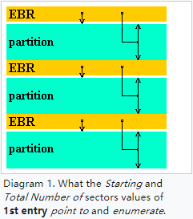

磁盘分区表结构分析

    
    
    

[TOC]

## 1.磁盘

### 1.1 基本构造

磁盘（*Disk*）又被称为磁盘驱动器（*Disk driver*），是由一个或多个叠放在一起的**盘片（*Platter*）**组成的机械装置。每个盘片有上下两**面（Surface）**，表面覆盖着磁性记录材料。盘片中央有一个可以旋转的主轴（*Spindle*），它能使盘片以固定的旋转速率（*Rotational Rate*）旋转，通常是5400-15000转每分钟（*Revolution Per Minute, RPM*）。盘片每个面上都对应有一个**磁头（*head*）**进行读写操作。

盘片表面由一组称为**磁道（*Track*）**的同心圆组成，每个磁道被划分为数个**扇区（*Sector*）**，每个扇区包含相同数量的数据位（旧式硬盘为512字节，新式硬盘为4096字节）。盘片表面上到主轴中心距离相等的磁道的集合称为**柱面（*Cylinder*）**，例如，一个磁盘有三个盘片六个盘面，每个盘面上的磁道编号都是一致的，那么6个磁道*k*的集合就是柱面*k*。即，柱面数与一个盘面上的磁道数相同，一个柱面内的磁道数等于盘面数，亦等于磁头数。磁盘构造如下图所示：

在老式磁盘上，不同柱面的磁道所包含的扇区数是相同的，最靠内的磁道决定了磁道内的扇区数 ，这会导致外层磁道空间的严重浪费，因此现代磁盘则将柱面划分成了不同的**环带（*Zone*）**，同一环带内柱面的磁道含有相同数量的扇区，外层环带柱面的磁道比内层环带柱面的磁道拥有更多的扇区，例如下图的磁盘将柱面划分为3个环带：

### 1.2 磁盘容量

一个磁盘上可以记录的最大位数称为它的最大容量，简称为容量。了解了磁盘的基本构造就可以通过其物理参数计算出磁盘的容量，公式如下：

$$
磁盘容量 = \frac{字节数}{扇区}×\frac{平均扇区数}{磁道}×\frac{磁道数}{表面}×\frac{表面数}{盘片}×\frac{盘片数}{磁盘}
$$
例如，假设一个磁盘有5个盘片，每个扇区512字节，每个面20000条磁道，每条磁道平均300个扇区，那么这个磁盘的容量是：

$$
磁盘容量 = \frac{512字节}{扇区}×\frac{300扇区}{磁道}×\frac{20000磁道}{表面}×\frac{2表面}{盘片}×\frac{5盘片}{磁盘} = 30720000000字节 = 30.72GB
$$

注意，硬盘制造商是以千兆字节（GB）或兆兆字节（TB）为单位来表达磁盘容量的，1GB=10^9^字节，1TB=10^12^字节，而DRAM和SRAM的计量单位为1K=2^10^，1M=2^20^，1G=2^30^，1T=2^40^，这也导致了在操作系统中看到的磁盘容量比厂家标称的容量要小的原因。题外话，网络速率的计量单位与磁盘相同。

### 1.3 寻址方式

#### 1.3.1 CHS(Cylinder-head-sector)

CHS寻址是通过磁盘的柱面和磁头确定磁道，并在该磁道中查找到所需扇区的过程，因此扇区也是CHS的最小寻址单元。

* Cylinder：柱面是磁盘中所有盘片表面上到主轴中心距离相等的磁道的集合，因此通过柱面即可确定要操作的磁道所属的集合，柱面从0开始编址，位于盘面最外圈。
* Head：磁盘中每个可记录数据的盘面都对应有一个磁头，通过柱面和磁头可确定要操作的磁道，磁头从0开始编址。
* Sector：扇区大小在计算机历史上有128、256、512、1024字节等多种规格，以512字节为主流。2010年以来的新式硬盘基本都已使用4096字节的扇区规格，但都可以模拟为512字节。需要注意的是，在CHS编址中，扇区号从**1**开始，而不是从0开始。

BIOS INT 13*h*接口使用24位CHS编址格式，其中**10**位用于柱面，**8**位用于磁头，**6**位用于扇区，由此可计算出24位CHS的寻址范围约为**8G**：
$$
2^{10}×2^{8}×(2^{6}-1)×512=8,455,716,864 Bytes
$$
有意思的是，DOS 7.1及以下所有版本都存在BUG，导致在有256个磁头的磁盘上启动时系统崩溃，因此当时的BIOS和DOS都将磁头编址范围限制在了0-254。

ATA-2（EIDE）标准引入了28位CHS编址，其中**16**位用于柱面，**4**位用于磁头，**8**位用于扇区，扇区仍从1开始编址。28位CHS的寻址范围约为136G（127.5GiB）：
$$
2^{16}×2^{4}×(2^{8}-1)×512=136,902,082,560 Bytes
$$
CHS的寻址范围对于如今的磁盘来说已经太小，已不再使用。

#### 1.3.2 LBA(Logical block addressing)

LBA是非常简单的线性编址模式，其将磁盘分为512字节的块，并从0开始索引，第一个块称为LBA0，第二个块称为LBA1，以此类推。IDE标准引入了22位LBA，ATA-1标准引入了28位LBA，ATA-6引入了48位LBA，使寻址范围达到了144PB。

MBR的Partition entry中使用4字节记录LBA地址，因此MBR分区表支持的寻址范围是2^32^×512=2TiB。

## 2.Master Boot  Record(MBR)

1983年3月，IBM通过PC DOS 2.0引入了对磁盘分区的支持及Master Boot Record。MBR支持的最大磁盘大小为2TiB，随着大容量磁盘的广泛应用，MBR已经逐渐被GUID Partition Table(GPT)取代。

MBR保存在磁盘的第一个扇区中，如果使用CHS寻址，其地址为0柱面、0磁头、1扇区；如果使用LBA寻址，则位于LBA0。

MBR的大小为512字节，主要包括以下内容：

* 引导代码（Bootstrap code）
* 分区表（Partition table）
* 32位磁盘时间戳（Disk timestamp）
* 32位磁盘签名（Disk signature）

不同操作系统和工具对MBR格式的定义不尽相同，下面只介绍最常见的经典通用MBR格式和现代标准MBR格式。

### 2.1 经典通用MBR（Classical generic MBR）

### 2.2 现代标准MBR（Modern standard MBR）

### 2.3 分区表（Partition table）

从以上两种格式的MBR中可以发现有64字节的分区表，分为4个***Partition entry***，可以记录4个分区信息，所谓磁盘分区就是对这64个字节的分区表进行设置。

Partition entry的主要功能就是记录分区的起始位置及大小，其格式及各字段的含义如下图所示。[1.3章节](###1.3 寻址方式)已经分析过，CHS寻址的范围太小，现在多采用LBA寻址，因此Partition entry中比较重要的字段是分区类型（*Partition type*，字段定义可参考该网页[Partition type Wiki](https://en.wikipedia.org/wiki/Partition_type)）、本分区起始扇区的LBA索引（偏移0x08）以及本分区扇区总数（偏移0x0C）。MBR分区表使用4字节保存扇区起始地址和扇区数量，因此最大只能支持2^32^×512=2TiB的分区以及4TiB的磁盘（这要求分区时除最后一个分区外所有分区都在2TiB地址以内，最后一个分区从2^32^-1扇区起始且大小为2^32^-1）。

分区表最多记录4个主分区（Primary  partition），想要划分更多分区就需要使用扩展分区（Extended partition），该扩展分区可再划分为多个逻辑分区（Logical partition）。注意，分区表中最多只能有**一个**扩展分区。

### 2.4 Extended boot record（EBR）

逻辑分区的相关描述储存在一个或多个名为Extended boot record(EBR)的数据结构中，第一个EBR位于扩展分区的第一个扇区，如果存在多个逻辑分区，则**每个逻辑分区前都有一个EBR**，该EBR会指向下一个EBR，从而形成一个EBR链表。这也意味着逻辑分区的数量只受扩展分区容量的限制。

EBR的结构与MBR类似，同样为512字节，但每个EBR的分区表只描述一个逻辑分区以及其与下一个EBR的关系，因此只会用到两个Partition entry，且Partition entry的字段含义与MBR的不同。

Partition entry 1用于指向属于该EBR的逻辑分区，字段含义如下：

* 起始扇区：本EBR扇区与逻辑分区第一个扇区的相对偏移。注意，对于同一个磁盘上的EBR，该值通常是相同的，例如Windows XP中该值通常为63
* 扇区数：逻辑分区的扇区总数。注意，EBR与逻辑分区间未使用的扇区不属于逻辑分区

Partition entry 2用于指向下一个EBR，如果本EBR是最后一个，则填充为0。字段含义如下：

* 分区类型：0x05（CHS编址）或0x0F（LBA编址）
* 起始扇区：下一个EBR扇区与扩展分区**第一个**EBR扇区的相对偏移
* 扇区数：下一个逻辑分区的扇区总数，注意，该数**包括**下一个EBR扇区以及EBR与逻辑分区间未使用的扇区

下面的图例可以帮助更好的理解EBR Partition entry，图中的扩展分区共有6000个扇区，分为3个逻辑分区：

## 3.GUID Partition Table(GPT)

为了突破BIOS的种种限制（如16位处理器模式、1MB地址空间等），Intel在1990年代后期开发了Extensible Firmware Interface (EFI)。2005年7月，Intel停止了EFI的开发，并将其贡献给了Unified EFI论坛，形成了如今的Unified Extensible Firmware Interface(UEFI)标准。

UEFI引入了名为GUID Partition Table(GPT)的分区表，GPT使用64位LBA地址（仅使用LBA，不再支持CHS），最大可寻址2^64^个扇区。对于使用512字节扇区的磁盘，最大可支持空间为9.4ZB[^1]或8ZiB(2^64^ ×  512)； 对于使用4096字节扇区的磁盘，最大可支持空间为75.6ZB或64ZiB。

与MBR仅使用第一个512字节区块不同，GPT使用34个LBA区块记录分区信息，且用磁盘的最后33个LBA进行备份。GPT的结构如下图所示，其中LBA0是保护性MBR（Protective MBR），LBA1是GPT表头（GPT Partition table header），LBA2\~33用于记录分区。

### 3.1 LBA0->Legacy  MBR/Protective MBR

为了获得一定的向后兼容性，GPT规范中保留对传统MBR的支持，称为*Legacy  MBR*，同时定义了***Protective MBR***，其目的防止基于MBR的磁盘工具无法识别并覆盖GPT分区表。Legacy  MBR或Protective MBR存储在LBA0中。

Protective MBR分区表的分区类型字段为0xEE，以表明这是GPT protective MBR。不支持GPT的操作系统和磁盘工具通常会认为磁盘包含一个未知类型分区，且没有剩余空间，从而不会修改磁盘分区表，降低发生错误的风险。

在一些仍旧通过BIOS启动且支持GPT的操作系统中，Protective MBR中依旧可以存储第一阶段的启动代码，以用来识别GPT分区表。

### 3.2 LBA1->Partition table header

LBA1用于保存GPT分区表头（Partition table header），主要包括分区表自身位置与大小，备份GPT位置，表头CRC32校验码，Partition entry数目、大小及位置等信息，具体格式如下图所示：

### 3.3 LBA2~LBA33->Partition Entry Array

LBA2~LBA33用于存储描述分区信息的Partition entry，UEFI规范中将其统称为***Partition Entry Array***。每个Partition entry最小为128字节，一个LBA可存储4条分区信息，因此32个LBA最多可支持128个分区。

Partition entry包括以下字段

* 分区类型GUID（Partition type GUID）：用于标识分区类型，如EFI System分区的GUID为*C12A7328-F81F-11D2-BA4B-00A0C93EC93B*，更多定义可参考[Partition type GUIDs](https://en.wikipedia.org/wiki/GUID_Partition_Table#Partition_type_GUIDs)
* 分区唯一GUID（Unique partition GUID）：创建分区时要分配分区的唯一GUID
* 分区起始地址（Starting LBA）：分区64位LBA起始地址
* 结束LBA地址（Ending LBA）：分区64位LBA结束地址
* 属性标识（Attribute flags）：分区各类属性，0\~2位为通用属性，48\~63位由个分区类型定义
* 分区名（Partition name，最大36字节Unicode）：分区字符名，增强易用性

想了解更多GPT定义请参考UEFI规范手册第5章。

-----

## 参考文献

1. 深入理解计算机系统 第3版
2. 鸟哥的Linux私房菜 第4版
3. GRUB2及启动过程详解
4. [Master boot record Wiki](https://en.wikipedia.org/wiki/Master_boot_record#cite_ref-note-3_19-0)
5. [Cylinder-head-sector Wiki](https://en.wikipedia.org/wiki/Cylinder-head-sector#Heads)
6. [Logical block addressing Wiki](https://en.wikipedia.org/wiki/Logical_block_addressing)
7. [Parallel ATA Wiki](https://en.wikipedia.org/wiki/Parallel_ATA)
8. [Extended boot record Wiki](https://en.wikipedia.org/wiki/Extended_boot_record)
9. [Unified Extensible Firmware Interface Wiki](https://en.wikipedia.org/wiki/Unified_Extensible_Firmware_Interface)
10. [GUID Partition Table Wiki](https://en.wikipedia.org/wiki/GUID_Partition_Table)
11. Unified Extensible Firmware Interface (UEFI) Specification

------

[^1]: ZB定义请参考[Zettabyte Wiki](https://en.wikipedia.org/wiki/Zettabyte)