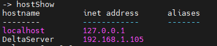
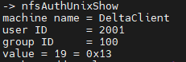
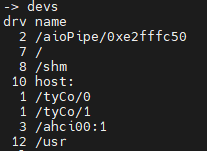
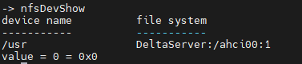

# 道系统下NFS的使用方法

[[TOC]]

Network File System(NFS)设备允许使用NFS协议访问远程系统上的文件。NFS协议指定了从远程主机读取文件的客户端软件与将文件导出到远程机器的服务器软件。

道系统提供了Network File System(NFS)的实现应用程序协议，包括版本2和3

## 1.道系统为NFS Client

### 1.1配置道系统为NFS Client

在道系统下，模板里已经支持NFS协议版本2与3，只需要配置如下宏使能`NFS Client`即可

+ `CONFIG_INCLUDE_NFS_CLIENT`
+ `CONFIG_INCLUDE_FS_NFS`

### 1.2设置NFS Client

想要设置道系统为`NFS Client`并用它挂载一个远程NFS系统，需要的操作步骤如下所示：

1. 如果你没有设置`usr name`、`usr ID`、`group name`等必要参数，可以手动调用函数`nfsAuthUnixSet`进行参数配置，见[1.2.1](####设置`NFS Client`用户参数)
2. 调用`hostAdd`添加远程NFS系统到道系统下的`host table`表中),见[1.2.2](####添加远程`NFS`系统至主机表(`Host Table`))
3. 调用`nfsMount`或者`nfsMountAll`来挂载一个远程文件系统,见[1.2.3](####挂载远程文件系统)

#### 1.2.1 设置NFS Client用户参数

对于道系统，可以设置`NFS usr name,usr ID,group name`通过使用`NFS_USER_ID`与`NFS_GROUP_ID`这两个事先定义好的宏。如果配置了`NFS Client`，那么在系统启动过程中会自动调用`nfsAuthUnixSet`使用这些设置的值。

但是有些道系统版本没有设置启动参数，所以通过`nfsAuthUnixShow`会看到没有`usr name`这时就需要我们手动调用`nfsAuthUnixSet`或`nfsAuthUnixPrompt`进行设置。

```mark
例设置usr name为DeltaClinet,NFS usr ID为1000，NFS group为200
> nfsAuthUnixSet "DeltaClinet",1000,200,0
```

`nfsAuthUnixPrompt`接口则更为灵活，它提供一种交互式的方式，可以通过`shell`输入参数。

#### 1.2.2 添加远程NFS系统至主机表(Host Table)

在道系统下，想要挂载远程系统的文件系统，你必须明确远程系统的主机信息，即需要将远程系统的主机信息添加至道系统的主机表中，使用如下语法：

```markdown
hostAdd("host","IPaddress")
例：作为NFS client想要挂载主机名为DeltaServer，IP为192.168.1.105的系统中的文件系统，那么在NFS Client的操作方法为：
hostAdd ("DeltaServer","192.168.1.105")
```

#### 1.2.3 挂载远程文件系统

在道系统下，通过调用`nfsMount`或 `nfsMountAll`将会创建一个`I/O`设备，通过这个设备，可以进行标准文件操作。可以通过`nfsUnmount`来卸载一个文件系统，使用`nfsDevShow`可以显示挂载文件系统的详细信息。

```markdown
nfsMount使用：
nfsMount的语法格式如下：
 nfsMount("hostName","hostFileSys","localName")
 hostName:NFS Server主机名
 hostFileSys:NFS Server导出到远程系统的文件系统
 localName:NFS Client挂载后，本地文件系统名称
 例：NFS Client挂载挂载远程主机DeltaServer下的文件系统/ahci00:1到本地，并命名为/usr
 nfsMount "DeltaServer","/ahci00:1","/usr"
 挂载成功后，通过devs即可看到/usr，操作/usr即是操作/ahci00:1
```

```markdown
nfsMountAll使用：
如果你在挂载远程文件系统后，不需要指定一个新名字，那么可以考虑使用nfsMountAll
nfsMountAll的语法格式如下：
nfsMountAll("hostName","clientName",quietFlag)
hostName:NFS Server主机名
clientName:访问列表中指定的NFS Client名称（如果有的话），为NULL时，仅可挂载任何客户端都可以访问的文件系统。
quietFlag:一个布尔值，告诉nfsMountAll在何种情况下执行，FLASE表示详细模式，TRUE表示安静模式
```

在挂载远程文件系统之前，可以先使用`nfsExportShow`命令查看远程系统导出了那些文件系统。

```markdown
nfsExportShow使用：
在道系统下，只有通过这个命令显示出来的文件系统才能够被挂载到本地。
nfsExportShow语法格式：
nfsExportShow "hostName"
hostName:NFS Server主机名字，道系统下可以使用gethostname获取，linux与windows下可以使用hostname命令查看
```

<mark>注意</mark>:跨平台使用NFS服务时，`NFS Server`与`NFS Client`的协议版本一定要保持一致，协议版本不一致会导致挂载或者访问文件系统失败。

#### 1.2.4 使用示例

主机名为`DeltaServer`，网络地址为 `192.168.1.105`的系统，导出了一个名为`/ahci00:1`的文件系统至远程系统，主机名为`DeltaClient`，网络地址为`192.168.1.125`的设备想要挂载此文件系统，操作步骤如下：

```markdown
> nfsAuthUnixSet "DeltaClient",2001,100,0
> hostAdd "DeltaServer","192.168.1.105"
> nfsMount "DeltaServer","/ahci00:1","/usr"
```

`hostShow`



`nfsAuthUnixShow`



`devs`



`nfsDevShow`



## 2.道系统为NFS Server

在道系统下，模板里已经支持NFS协议版本2与3，只需要配置如下宏使能`NFS Server`即可

+ `CONFIG_INCLUDE_NFS_SERVER`
+ `CONFIG_INCLUDE_FS_NFS`

### 2.1 设置NFS Server

如果道系统要导出一个文件系统至远程系统，操作步骤如下：

1. 在主机表中添加本地主机名信息
2. 调用`nfsExport`导出文件系统

#### 2.1.1 主机表中添加本地主机信息

在道系统下，初始化`NFS Server`之前，未能将本地主机的信息添加进本地主机表中，所以需要手动调用`hostAdd`添加。

#### 2.1.2 导出文件系统

要使网络上的`NFS Client`可以访问道系统上的文件系统，必须使用`nfsExport`，例如以下语法导出道系统文件系统`/ahci00:1`

```markdown
nfsExport("/ahci00:1",0,FALSE,0);
第一个参数：指定要导出的文件系统名称
第二个参数：道系统NFS导出ID（0表示自动分配一个）
第三个参数：是否将文件系统导出为只读。TRUE：只读
第四个参数：未来扩展的占位符
```

<mark>注意</mark>:对于导出的NFS文件系统，设备名不能以一个`/`作为结束。

#### 2.1.2使用示例

主机名为`DeltaServer`，网络地址为`192.168.1.105`的系统想要将本地的文件系统`/ahci00:1`导出至远程系统，操作方法如下：

```markdown
> hostAdd "DeltaServer","192.168.1.105"
> nfsExport "/ahci00:1",0,0,0
```

