
2K1000 CAN接收数据错乱问题分析

[[TOC]]

## 1.问题现象

通过CAN逻辑分析仪抓取板卡发送出的CAN报文如下：

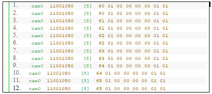

跟客户沟通得知，数据段内容符合预期，正常。

在异常状态下，通过`candump can0,11001050:DFFFFFFF`命令抓取CAN报文发现，收到的报文数据段内容发生错乱，不正常。

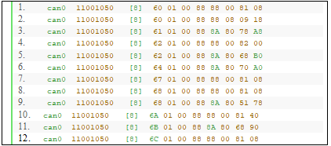

## 2.问题分析

 导致CAN报文数据出现错乱的可能原因有两个，一是CAN报文通过收发器进入2k1000之前数据已经被改变；二是收发器发给2K1000的数据是正常的，但通过2K1000的处理后，数据发生改变。

综合分析，CAN报文进入2K1000后数据发生改变的概率大一点。需要理解CAN控制器(SJA1000)的收包机制，再做进一步分析。

CAN在up后，其核心处理逻辑位于中`sja1000_interrupt`中。`sja1000_interrupt`函数对接收中断(RI)、发送中断(TI)、错误中断(EI)、数据溢出中断(DOI)、唤醒中断(WUI)、错误消极中断(EPI)、仲裁丢失中断(ALI)、总线错误中断(BEI)共计8种中断进行处理。

考虑到问题产生时的现象是接收到的数据出现错误，上述8种中断中，跟接收数据相关的只有两个，接收中断(RI)和数据溢出中断(DOI)。优先对RI和DOI的处理进行分析。

接收中断(RI)的处理如下：

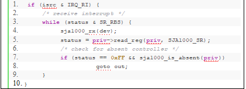

其处理逻辑为不断的访问状态寄存器(SR)，查看接收缓存器状态(RBS)。如果接收缓存器中有数据，则调用`sja1000_rx`来接收数据。

`sja1000_rx`函数原型如下：

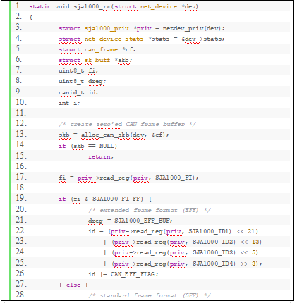

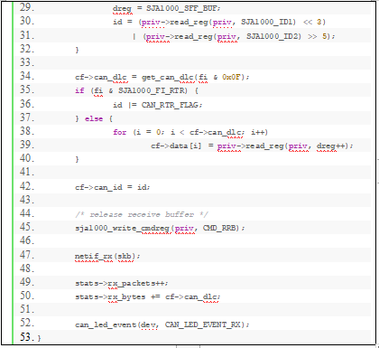

`	sja1000_rx`代码流程看起来是正常的。

43行之前的代码用来获取CAN ID及数据段内容

`sja1000_write_cmdreg(priv, CMD_RRB)`操作命令寄存器(CMR)，==释放接收缓冲器==。其后的代码跟网络收发包相关。

数据溢出中断(DOI)的处理如下：

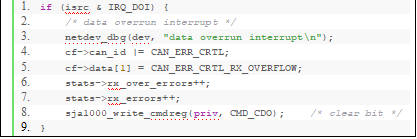

在发生数据溢出中断后，会在数据溢出时获取到的CAN报文的CAN ID和数据段加上错误标志，然后同步错包数，最后操作命令寄存器(CMR)，清除数据溢出。

将SJA1000的调试开关打开后，执行`dmesg`命令，发现出现数据段错乱问题的时候，`sja1000_interrupt`始终在处理数据溢出中断。

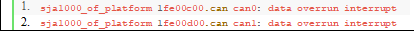

在之前的调试中发现，在数据段错乱的时候，通过对can进行down、up操作后，数据段错乱问题消失。执行上述操作后，通过`dmesg`查看日志，发现日志中无任何can打印。同时结合客户之前对问题的摸索，客户发现在CAN总线上数据量比较大的时候，才会发生该问题。==推测问题发生的时候大概率跟数据溢出有关，需要详细分析数据溢出中断的代码。==

数据溢出中断代码中，跟CAN控制器强相关的代码只有一行，该行代码操作命令寄存器，清除数据溢出。在`2K1000`用户手册中，并没有对清楚数据溢出的具体操作进行描述。需要查看SJA1000用户手册了解这部分处理的。

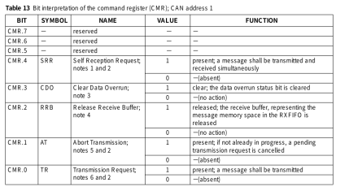

关于CDO，其描述如下：

CDO命令位用于清除由数据溢出状态位指示的数据溢出条件。只要数据溢出状态位被设置，就不会产生进一步的数据溢出中断。

其字面意思很简单，就是清除数据溢出状态位。需要查看数据溢出状态位的描述。

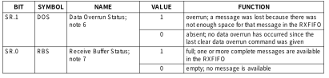

关于DOS，其描述如下：

当要接收的消息成功通过接受过滤器时，CAN控制器需要RX FIFO中的空间来存储消息描述符和已接收的每个数据字节。如果没有足够的空间来存储消息，则会丢弃该消息，并在该消息生效时向CPU指示数据溢出条件。如果此消息未成功完成（例如，由于错误），则不会指示超限情况。

也就是说，在产生数据溢出的时候，CAN控制器会主动丢弃一帧的数据来保证数据的正确性。实际上在发生问题的时候，RX frame information、RX identifier中的内容的都是正确的，只有RX data中的数据是错乱的。同时也不知道RX FIFO中哪些数据是错误的，因此对此处理的最好办法是将RX FIFO中的数据全部清除，保证RX FIFO中没有错误数据。

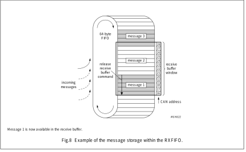

接收缓冲器是RX FIFO的可访问部分，并且位于CAN地址16和28之间的范围内。每个消息被细分为一个描述符和一个数据字段。

从上图可以注意到，接收缓冲区窗口的地址为16-28，该窗口在读模式下存储RX frame information、RX identifier、RX data信息。通过release receive buffer command释放接收缓冲区窗口的数据。

release receive buffer command需要通过操作CMR完成。在读取接收缓冲器的内容之后，微控制器可以通过将释放接收缓冲器位设置为逻辑1来释放RXFIFO的这个存储空间。这可能导致另一个消息在接收缓冲器内变得立即可用。如果启用，此事件将强制另一个接收中断。如果没有其他可用的消息，则不产生进一步的接收中断，并且清除接收缓冲器状态位。

## 3.解决方法

由此可见，多次调用release receive buffer command可以达到清空RX FIFO的效果。结合之前测试过程中发现的数据段错乱的问题，推测理论上在出现问题的时候(数据溢出时)，将RX FIFO整体清空后，后续到达的数据就会变正常。

考虑到出问题时，只有RX data(8字节)出问题，RX FIFO总共64字节，所以进行8次释放操作，来达到清空RX FIFO的效果。

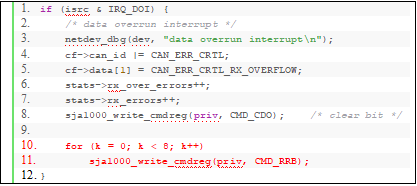

实际上，可以通过RBS(Receive Buffer Status)来判断RX FIFO中是否有数据。上述for循环可以使用如下函数代替。

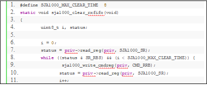